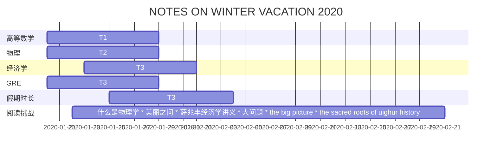

**NOTES ON WINTER VACATION 2020** 

Reading List

- [ ] 1.三体
- [ ] 2.薛兆丰经济学讲义
- [ ] 3.美丽之问
- [ ] 4.大问题
- [ ] 5.什么是物理学
- [ ] 6.the sacred routs of Uighur history
- [ ] 7.the big picture 

 

2020 WINTER

